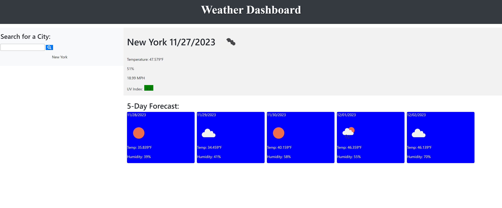

# Weather Dasboard

## Description

The Weather Forecast Dashboard is a web application that provides real-time weather information for cities worldwide. It allows users to search for cities, view current weather conditions, forecasts, and historical weather data.

# Table of Contents:

- [Installation](#installation)
- [Usage](#usage)
- [License](#license)
- [Acknowledgments](#Acknowledgments)
- [Questions](#questions)

## Installation

N/A

## Usage

Provide instructions on how to use the website.

1. Open the website in your browser.
2. Enter a city name in the search bar and click the search button.
3. View the current weather and forecast.

# License:

This project is licensed under the terms of the **[MIT License](https://opensource.org/licenses/MIT)**

## Acknowledgments

If you wish, acknowledge anyone or any resource that helped you in the project.

- [FontAwesome](https://fontawesome.com/)
- [Bootstrap](https://getbootstrap.com/)
- [OpenWeatherMap API](https://openweathermap.org/api)

# Questions

If you have any questions or suggestions about this project, please feel free to contact me:

- GitHub: [@rodrigo0599](https://github.com/rodrigo0599)
- Email: rodrigo0599@hotmail.com
